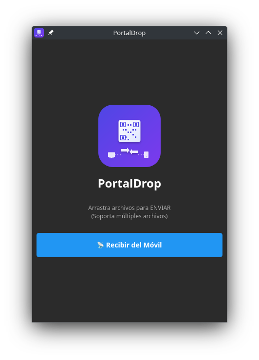

# 📡 PortalDrop

<div align="center">
  
  
  <br><br>
  
  
  
  <br><br>
  
  <p><b>El "AirDrop" Universal para Linux.</b></p>
  <p>Transfiere archivos entre tu PC y cualquier dispositivo móvil (iOS/Android) sin instalar nada en el teléfono.</p>
</div>

---

## 📸 Capturas de Pantalla

<div align="center">
  
  <p><i>Interfaz minimalista en modo oscuro con soporte Drag & Drop</i></p>
</div>

---

## 🚀 ¿Qué es PortalDrop?

PortalDrop es una herramienta de escritorio minimalista construida con **Python** y **Qt6 (PySide6)**.

Resuelve un problema común: **Pasar una foto o documento del móvil al PC (o viceversa) rápidamente**, sin cables, sin subir cosas a la nube, y sin comprimir la calidad (como hace WhatsApp).

### ✨ Características
* **Sin instalación en el móvil:** Solo escaneas un QR y listo. Usa el navegador web.
* **Arrastrar y Soltar:** Arrastra un archivo a la ventana para generar un enlace de descarga instantáneo.
* **Bidireccional:** ¿Quieres pasar una foto del móvil al PC? Pulsa "Recibir" y súbela desde el navegador.
* **Privacidad Local:** Los archivos nunca salen de tu red WiFi. La transferencia es directa (P2P local).
* **Interfaz Moderna:** Modo oscuro nativo y diseño limpio.

---

## 🛠️ Instalación y Uso

### Prerrequisitos
* Python 3.10 o superior.
* Estar conectado a la misma red WiFi/LAN en ambos dispositivos.

### 1. Clonar y preparar entorno
```bash
# Clonar el repositorio
git clone https://github.com/danitxu79/PortalDrop.git
cd PortalDrop

# Crear entorno virtual
python3 -m venv venv
source venv/bin/activate  # En Windows: venv\Scripts\activate

# Instalar dependencias
pip install -r requirements.txt
```

### 2. Ejecutar

Asegúrate de tener el archivo `portaldrop-512.png` en la carpeta para ver el icono.

```bash
python PortalDrop.py
```

---

## 🔧 Solución de Problemas (Troubleshooting)

**El móvil no carga la página / "Connection Refused"**

Esto suele ser culpa del cortafuegos (Firewall) de Linux.

* **Solución rápida:** Asegúrate de permitir el tráfico en el puerto **8000**.
  ```bash
  sudo ufw allow 8000/tcp
  ```
* **Nota:** Si tu IP local cambia, reinicia la aplicación.

---

## 🧠 Cómo funciona (Tech Stack)

* **Frontend:** PySide6 (Qt6).
* **Backend:** Servidor HTTP nativo de Python (`http.server` y `socketserver`) ejecutado en hilos separados (`QThread`) para no congelar la interfaz.
* **Red:** Detecta automáticamente la IP de la LAN abriendo un socket UDP efímero.
* **Protocolo:** HTTP estándar. Los archivos se envían tal cual (binario) mediante `Multipart/Form-Data` para subidas.

---

## ðŸ"¸ Screenshot

<div align="center">
  
</div>

---

## 📦 Crear un Ejecutable

Si quieres distribuir PortalDrop sin necesidad de instalar Python, puedes crear un ejecutable con **PyInstaller**:

```bash
# Instalar PyInstaller
pip install pyinstaller

# Crear ejecutable
pyinstaller --onefile --windowed --icon=portaldrop-512.png --name=PortalDrop PortalDrop.py
```

El ejecutable estará en la carpeta `dist/`.

---

## 📄 Licencia

Este proyecto se ofrece bajo un modelo de **Doble Licencia (Dual License)**:

1. **LGPLv3 (GNU Lesser General Public License v3):**
   Ideal para proyectos de código abierto. Si usas esta biblioteca (especialmente si la modificas), debes cumplir con las obligaciones de la LGPLv3. Esto asegura que las mejoras al núcleo open-source se compartan con la comunidad.

2. **Comercial (Privativa):**
   Si los términos de la LGPLv3 no se ajustan a tus necesidades (por ejemplo, para incluir este software en productos propietarios de código cerrado sin revelar el código fuente), por favor contacta al autor para adquirir una licencia comercial.

Para más detalles, consulta el archivo `LICENSE` incluido en este repositorio.

---

## 📬 Contacto y Autor

Desarrollado por **Daniel Serrano Armenta**

* 📧 **Email:** [dani.eus79@gmail.com](mailto:dani.eus79@gmail.com)
* 🐙 **GitHub:** [github.com/danitxu79](https://github.com/danitxu79/)
* 🌐 **Portafolio:** [danitxu79.github.io](https://danitxu79.github.io/)

---

*Si encuentras útil este proyecto, ¡no olvides darle una ⭐ en GitHub!*
